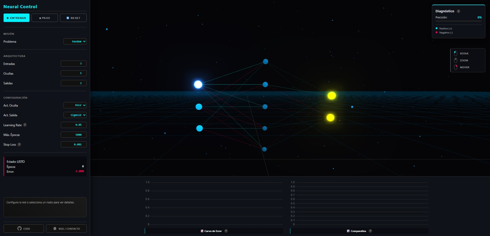
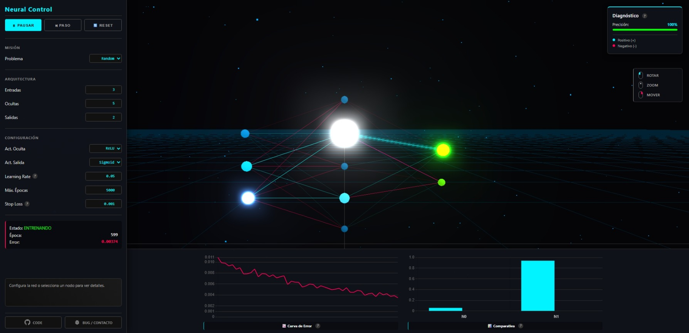

<div align="center">

# 🧠 Neural 3D Simulator


<br>

> **Visualización interactiva en tiempo real del proceso de aprendizaje de una Red Neuronal Artificial (ANN), construida sobre fundamentos matemáticos y renderizada en 3D.**

<br>

<a href="https://mnahuelanca.github.io/Neural-Network-Simulator/" target="_blank">
  
</a>

<br>

<a href="https://github.com/mnahuelanca/Neural-Network-Simulator" target="_blank">
  
</a>
&nbsp;&nbsp;
<a href="https://github.com/mnahuelanca/Neural-Network-Simulator/issues" target="_blank">
  
</a>

</div>

<br>

---

## 🖼️ Vistazo General
<div align="center">

| 🌌 Vista General | 🧠 Entrenamiento |
| :---: | :---: |
|  |  |

| 📊 Diagnóstico y Métricas |
| :---: |
|  |

</div>


## 📖 Sobre el Proyecto

Este simulador nace con el objetivo de **materializar y visualizar gráficamente** los conceptos teóricos adquiridos durante mi **Tecnicatura en Ciencia de Datos e Inteligencia Artificial**.

La meta es abrir la "caja negra" del aprendizaje automático y mostrar qué sucede matemáticamente dentro de las neuronas mientras aprenden.

### 🤖 A Note on "Vibecoding"

> Este proyecto fue desarrollado bajo la filosofía de **Vibecoding**.

Es importante mencionar que, si bien la lógica teórica y el diseño del sistema provienen de mis estudios, **gran parte de la implementación del código fue realizada en colaboración con Asistentes de IA**.

El uso de IA me permitió:
1.  **Acelerar el desarrollo:** Saltar la barrera de entrada de la sintaxis compleja de gráficos 3D (Three.js).
2.  **Iteración Visual:** Probar rápidamente ideas estéticas y de interfaz.
3.  **Enfoque en Lógica:** Centrarme en **cómo mostrar el funcionamiento de la red neuronal** y la experiencia de usuario, actuando como arquitecto del proyecto mientras la IA actuaba como el "constructor" del código.

---

## ✨ Características Principales

*  **Motor Neuronal Propio:** Implementación manual de Perceptrones Multicapa (MLP) utilizando matrices puras en JS (sin librerías externas de IA).
*  **Visualización 3D (Three.js):**
    * **Neuronas:** Se iluminan y escalan según su nivel de activación.
    * **Sinapsis:** Las conexiones cambian de color (Cian/Magenta) y opacidad en tiempo real según el peso.
*  **Playground Interactivo:**
    * Modifica la arquitectura (capas, neuronas) al vuelo.
    * Ajusta hiperparámetros: *Learning Rate*, *Epochs*, *Stop Loss*.
    * Cambia funciones de activación: *Sigmoid, ReLU, Tanh, Linear*.
*  **Datasets Educativos:** Pruebas con compuertas lógicas (AND, OR, XOR) y clasificación de colores (RGB).
*  **Métricas en Vivo:** Gráficos de *Loss* (Pérdida) y *Accuracy* (Precisión) actualizados por época.

---

## 🛠️ Tecnologías

* **Core:** Vanilla JavaScript (ES6+ Modules).
* **Renderizado:** [Three.js](https://threejs.org/) + EffectComposer (Bloom/Glow).
* **Gráficos UI:** [Chart.js](https://www.chartjs.org/).
* **Estilos:** CSS3 Custom Properties (Cyberpunk/Dark UI).

---

## 🚀 Instalación Local

Si deseas correr este proyecto en tu máquina local para modificarlo:

1.  **Clonar el repositorio:**
    ```bash
    git clone [https://github.com/mnahuelanca/Neural-Network-Simulator.git](https://github.com/mnahuelanca/Neural-Network-Simulator.git)
    cd Neural-Network-Simulator
    ```

2.  **Ejecutar:**
    Debido al uso de Módulos ES6, necesitas un servidor local (no puedes abrir el `index.html` directamente).

    * Con **VS Code**: Instala la extensión "Live Server", click derecho en `index.html` -> *"Open with Live Server"*.
    * Con **Python**:
        ```bash
        python -m http.server 8000
        ```
    * Con **Node.js**:
        ```bash
        npx http-server .
        ```

3.  Abre tu navegador en `http://localhost:8000`.

---

## 📚 Conceptos Aplicados

El código refleja la aplicación práctica de:
1.  **Forward Propagation:** Producto punto entre entradas y pesos + Bias.
2.  **Funciones de Activación:** Introducción de no-linealidad (clave para resolver problemas como XOR).
3.  **Función de Costo (Loss Function):** Mean Squared Error (MSE).
4.  **Backpropagation:** Aplicación de la Regla de la Cadena para calcular gradientes.
5.  **Optimizador:** Descenso del Gradiente Estocástico (SGD).

---

## 🤝 Contacto

**Maximiliano Nahuelanca**

* 🐙 [GitHub](https://github.com/mnahuelanca)
* 📧 [Email](mailto:maxinahuelanca@gmail.com)
* 🌐 [LinkedIn](https://www.linkedin.com/in/maxinahuelanca/)

---
<div align="center">
  <i>Argentina - 🇦🇷</i>
</div>